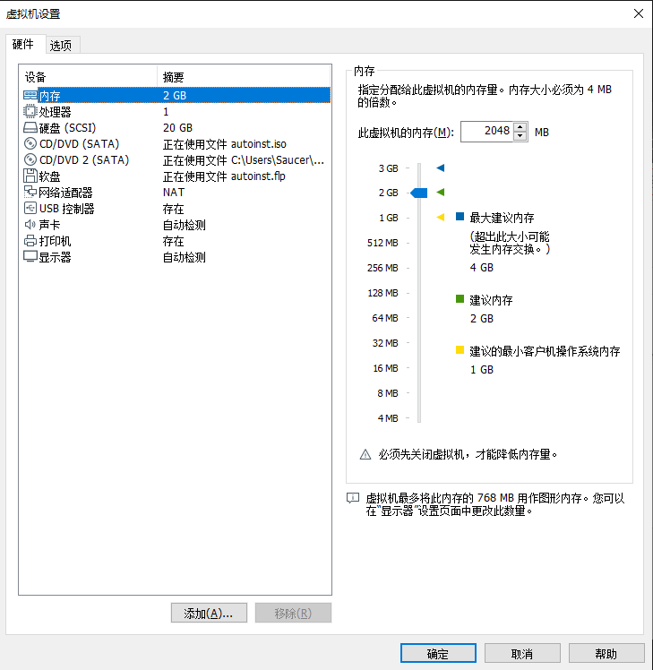
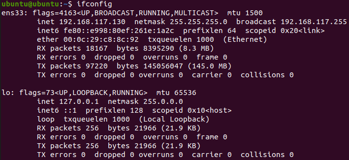
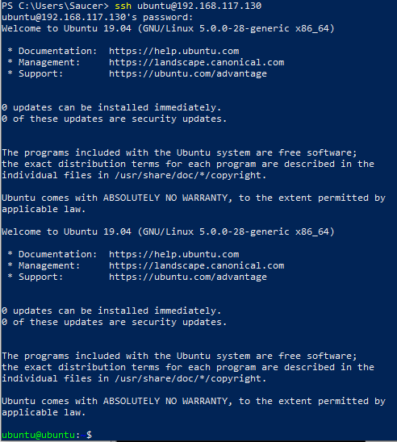
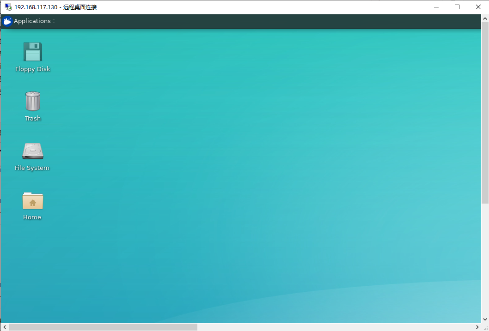

# HW1：搭建一个简单的云桌面服务

> 多次尝试CentOS 7失败后，投降使用Ubuntu进行实验。

基本上大一大二每个学期都会有期末上机考试的课程，为了方便统一考试环境的配置，常在云桌面配置的环境下进行考试。其实，云桌面也就跟Windows自带的远程桌面连接没有多大区别，唯一不同的就是一般我们使用远程桌面连接的主机是一个PC机，而云桌面一般是虚拟机。那么，在这次实验中，我们来尝试自己搭建一个简单的云桌面服务。

## 实验目的 

1. 初步了解虚拟化技术，理解云计算的相关概念。
2. 理解系统工程师面临的困境。
3. 理解自动化安装、管理（DevOps）在云应用中的重要性。

## 实验环境和要求

- 虚拟机操作系统 Ubuntu19.04，能使用 NAT 访问外网。
- 用户通过互联网，使用微软远程桌面，远程访问我在PC机上创建的虚拟机。

## 实验过程

### <1> 安装虚拟机

- 下载安装VMware软件（之前装有）
- 下载[Ubuntu镜像](https://ubuntu.com/download/desktop)

- 安装Ubuntu虚拟机

在 VMware 软件中”新建虚拟机“，并给虚拟机分配了 30G 的磁盘和 2G 内存，网卡选择 NAT 模式其他配置保持默认。安装虚拟机时给操作系统创建一个账号用户名为ubuntu，密码为liang。



### <2> 安装ssh

安装软件前可以先更改系统的镜像源，这样在下载资源的时候会更快一些。

先执行 `sudo vi /etc/apt/sources.list`，然后将文件的内容替换成以下内容

```shell
deb http://mirrors.aliyun.com/ubuntu/ disco main restricted universe multiverse
deb-src http://mirrors.aliyun.com/ubuntu/ disco main restricted universe multiverse
deb http://mirrors.aliyun.com/ubuntu/ disco-security main restricted universe multiverse
deb-src http://mirrors.aliyun.com/ubuntu/ disco-security main restricted universe multiverse
deb http://mirrors.aliyun.com/ubuntu/ disco-updates main restricted universe multiverse
deb-src http://mirrors.aliyun.com/ubuntu/ disco-updates main restricted universe multiverse
deb http://mirrors.aliyun.com/ubuntu/ disco-backports main restricted universe multiverse
deb-src http://mirrors.aliyun.com/ubuntu/ disco-backports main restricted universe multiverse
deb http://mirrors.aliyun.com/ubuntu/ disco-proposed main restricted universe multiverse
deb-src http://mirrors.aliyun.com/ubuntu/ disco-proposed main restricted universe multiverse
```

然后再执行 `sudo apt update` 即可，最后再执行以下指令安装ssh：

```shell
sudo apt install -y openssh-server
```

### <3> SSH 登录验证

先查看虚拟机的ip地址：

```shell
# 由于需要使用ifconfig工具，故先安装net-tools
sudo apt install -y net-tools
# 然后执行ifconfig指令查看虚拟机的ip地址
ifconfig
```



然后在PC上使用powershell尝试用ssh登录虚拟机。结果成功使用ubuntu账号登录虚拟机。



### <4>  安装远程云桌面

执行以下指令安装一些必要的软件包：

```shell
# 安装xrdp 
sudo apt-get install xrdp 
# 安装vnc4server 
sudo apt-get install vnc4server tightvncserver
# 安装xubuntu-desktop 
sudo apt-get install xubuntu-desktop
# 安装xfce4
sudo apt-get install xfce4
# 向xsession中写入xfce4-session 
echo “xfce4-session” >~/.xsession 
# 开启xrdp服务 
sudo service xrdp restart
```

安装完成后尝试使用PC的远程桌面软件进行登录发现一直显示蓝屏，需要执行以下指令，然后重启计算机。

```shell
wget http://www.c-nergy.be/downloads/install-xrdp-3.0.zip
unzip install-xrdp-3.0.zip
chmod 777 Install-xrdp-3.0.sh
./Install-xrdp-3.0.sh
sudo reboot
-----------------------------
参考：https://blog.csdn.net/cxn304/article/details/99733711
```

重启后再次尝试PC的远程桌面软件进行登录发现还是有问题，这次连接后直接闪退了，解决方法如下：

```shell
sudo vi /etc/xrdp/startwm.sh
# 在文件中添加
xfce4-session
# 最后重启xrdp服务
sudo service xrdp restart
```

最后成功使用PC远程登录ubuntu的虚拟机了。



### <5> 服务批量化

如果需要生成大量实例，可以使用VMware中的“克隆”功能对虚拟机进行复制，即能够快速地对虚拟机进行批量生产。

## 心得体会

一开始打算使用CentOS 7进行实验时遇到了一个困难：CentOS 7中xrdp软件依赖的SELinux-policy的版本高于CentOS 7所支持的最高版本，这似乎有点不太合常理，由于新版本的SELinux-policy依赖了更多的包，几乎无法手动一一安装（其实是懒），最终没有办法解决只能放弃了。

相比之下Ubuntu系统似乎更为友好，并且自己也相对比较熟悉该系统，因此更换系统后实验就更顺利了一些，以后如果有相关的实验可能都会优先考虑Ubuntu系统了。

整个实验下来，自己对虚拟化以及云相关的概念会更熟悉了一些，另外也接触了一下除Ubuntu之外的Linux系统——CentOS，收获也挺大的。

