# 安装 Go 开发环境

在 Ubuntu 系统下，也许你使用 `sudo apt install golang-go` 简单一行指令就能将 Go 安装到本地了。但在实际开发中，可能会遇到 Go 版本的问题，gvm 是 Go 的一个多版本管理工具，可以通过一些简单的指令随意切换本地使用的 Go 版本。另外配合 VSCode 和 Git 一同“服用”，将会有十分舒适的开发体验。

## 实验环境

- Ubuntu18.04

- gvm

- VSCode
- Git

## 安装 gvm

gvm 的安装也非常简单，只需在中断下执行一行简单的指令：

```shell
# 安装 gvm
bash < <(curl -s -S -L https://raw.githubusercontent.com/moovweb/gvm/master/binscripts/gvm-installer)
```

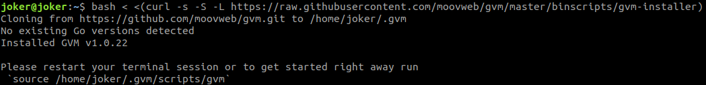

然后执行 `gvm version` 即可查看当前安装的 gvm 的版本。

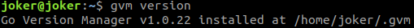

## 安装 Go

由于 Go 1.5 使用了自举（用 Go 写 Go），所以如果在系统环境完全没有 Go 命令的情况下，使用 `gvm install goxx` 会报错。可以先安装一个低版本的 Go1.4 ，然后再安装其他更新的版本。但如果连 Go1.4 也无法成功安装，那么最简单的做法就是先使用 `sudo apt install golang-go` 将 Go 安装到本地。

> 当然如果安装 Go 过程中遇到了网络问题，则需要开代理或者添加其他非官方源。

```shell
# 安装 Go1.4
gvm install go1.4
# 使用 Go1.4 作为构建环境
gvm use go1.4
# 设置自举环境变量
export GOROOT_BOOTSTRAP=$GOROOT
# 安装 Go 其他版本
gvm install go1.13
```

## 安装 Git

```shell
# 安装 Git
sudo apt install -y git
```

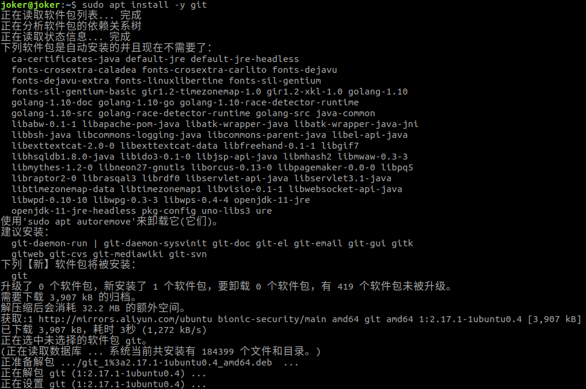

## 安装 VSCode

在图形界面中安装则在浏览器打开[官网](https://code.visualstudio.com/Download)，然后下载 VSCode 的 `.deb` 版本，下载完直接双击打开安装即可。

安装完 VSCode 最好安装 Go 相应的插件，在 Extensions 页面搜索 Go 关键字，即可找到以下插件并进行安装。

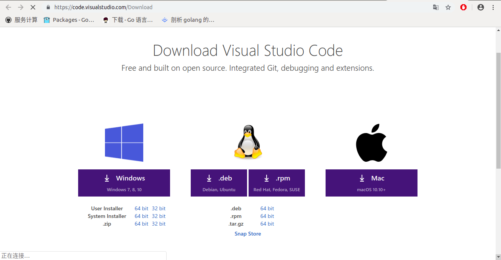

## 编写 Go 的第一个程序

- 打开终端，使用 gvm 配置 Go 环境。

```shell
# 使用 Go1.13
gvm use 1.13
# 查看 Go 版本
go version
# 查看 Go 工作目录
echo $GOPATH
```

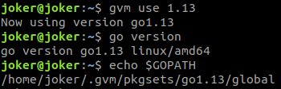

- 在任意目录下创建一个 `hello` 目录，并使用 VSCode 打开该目录，并在该目录下创建 `main.go` 文件，文件内容为：

```go
package main

import "fmt"

func main() {
    fmt.Printf("Hello, world!\n")
}
```

- 打开终端并进入到该目录下，先为该目录（项目）创建模块，然后编译安装该模块并运行由此创建的程序。

```shell
# 创建模块
go mod init github.com/liangwj45/hello
# 编译安装模块
go install github.com/liangwj45/hello
# 运行程序
hello
```

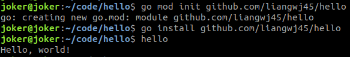

## 编写 Go 的第一个库

- 在刚才的项目中继续创建一个 `stringutil` 目录，作为包目录，并在该目录下创建 `reverse.go` 文件，内容如下：

```go
// stringutil 包含有用于处理字符串的工具函数。
package stringutil

// Reverse 将其实参字符串以符文为单位左右反转。
func Reverse(s string) string {
	r := []rune(s)
	for i, j := 0, len(r)-1; i < len(r)/2; i, j = i+1, j-1 {
		r[i], r[j] = r[j], r[i]
	}
	return string(r)
}
```

- 用 `go build` 指令来对该库进行编译：

```shell
# 对库进行编译
go build github.com/liangwj45/hello/stringutil
```

- 修改 `main.go` 的内容引用这个库，修改内容如下：

```go
package main

import (
	"fmt"

	"github.com/user/stringutil"
)

func main() {
	fmt.Printf(stringutil.Reverse("!oG ,olleH"))
}
```

- 重新编译安装该模块，并运行由此生成的程序：

```shell
# 编译安装模块
go install github.com/liangwj45/hello
# 运行程序
hello
```

 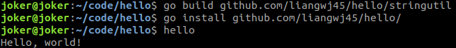

## 为你的库编写测试

Go 拥有一个轻量级的测试框架，它由 `go test` 命令和 `testing` 包构成。

你可以通过创建一个名字以 `_test.go` 结尾的，包含名为 `TestXXX` 且签名为 `func (t *testing.T)` 函数的文件来编写测试。 测试框架会运行每一个这样的函数；若该函数调用了像 `t.Error` 或 `t.Fail` 这样表示失败的函数，此测试即表示失败。

在原来的 `stringutil` 目录下创建 `reverse_test.go` 文件来为 `stringutil` 添加测试，文件内容如下：

```go
package stringutil

import "testing"

func TestReverse(t *testing.T) {
	cases := []struct {
		in, want string
	}{
		{"Hello, world", "dlrow ,olleH"},
		{"Hello, 世界", "界世 ,olleH"},
		{"", ""},
	}
	for _, c := range cases {
		got := Reverse(c.in)
		if got != c.want {
			t.Errorf("Reverse(%q) == %q, want %q", c.in, got, c.want)
		}
	}
}
```

- 使用 `go test` 进行测试：

```shell
# 运行测试
go test github.com/liangwj45/hello/stringutil
```

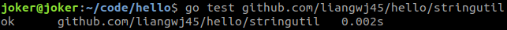

## 将你的库发布到开源网站上

如果需要将你的代码分享给其他人，像 Git 这样的开源代码网站就很不错。

你需要一个 Git 账号，然后登录 [github](https://github.com/) 官网为 hello 项目创建一个仓库：

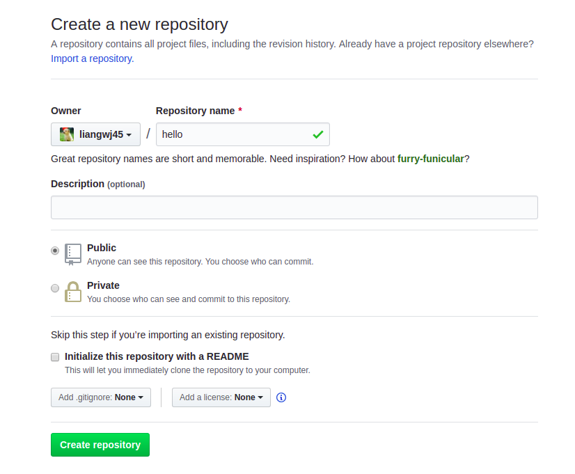

然后使用 git 指令将你的代码推送到远程仓库中：

```shell
# 进入项目的根目录
cd ~/code/hello/
# 初始化 git 仓库
git init
# 绑定远程仓库
git remote add origin git@github.com:liangwj45/hello.git
# 提交你的代码并推送到远程仓库
git add .
git commit -m 'first commit'
git push origin master
```

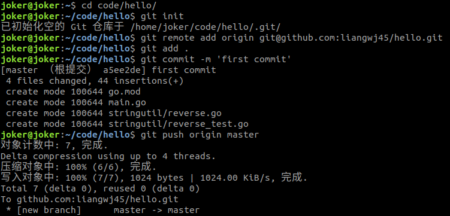

之后就可以在网站看到你的代码了。

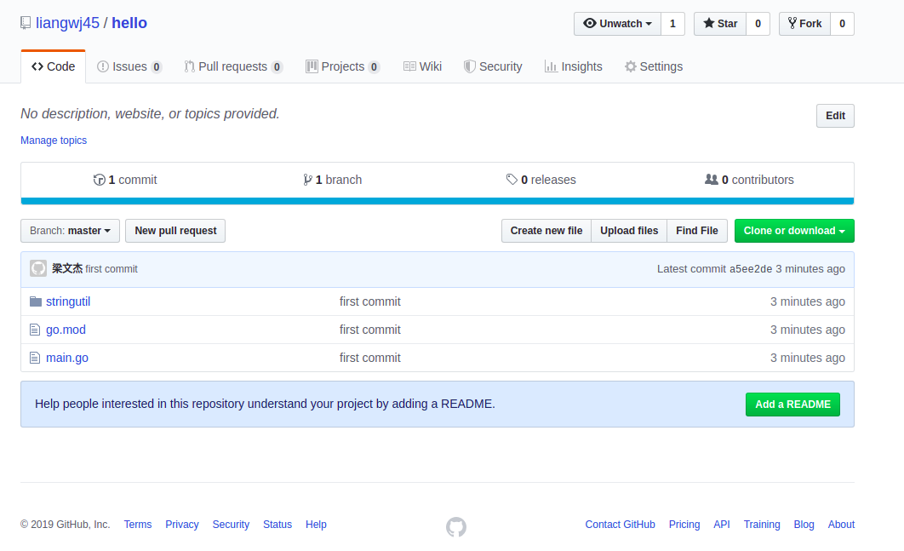