# 容器化技术与容器服务  

## 安装

由于之前已经装过 docker 了，直接查看 docker 的版本。

```bash
docker version
```


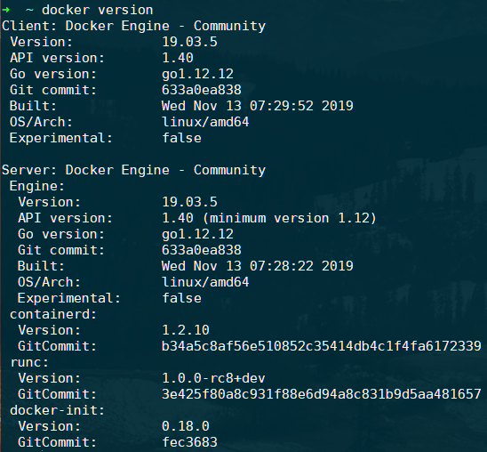

server 和 client 的版本都是 19.03.5 的版本。

## 基本操作

### 运行容器

运行第一个 docker 容器。

```bash
docker run hello-world
```

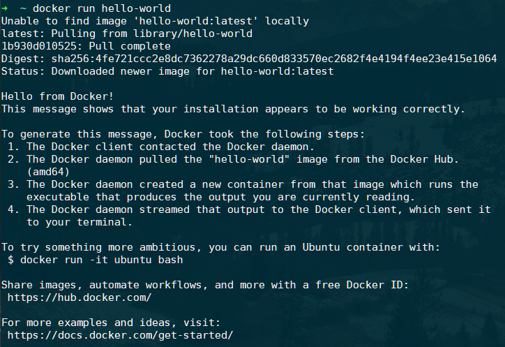

这个指令进行了两步操作，第一步是从 docker hub 中下载 hello-world:latest 镜像，然后第二步是根据这个镜像启动一个 docker 容器，容器运行时打印了上面的信息。

打印的信息提示我们使用 `docker run -it ubuntu bash` 指令进行更多的尝试。

```bash
docker run -it ubuntu bash
```

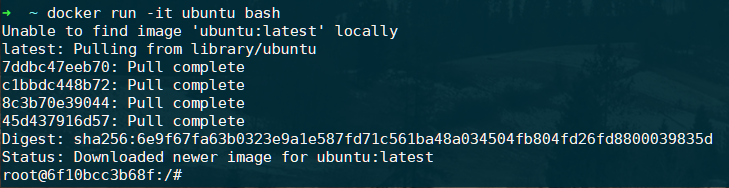

指令进行了类似于上个指令的操作，同样是从 docker hub 中下载了一个镜像，然后根据该镜像启动了一个容器，但这条指令带有 `-it` 的参数，加上参数后用户能够通过终端与进程（容器）交互，并将 stdin，stdout，stderr 定向到 TTY。启动后在容器内执行 bash 指令，可以看到就跟运行了一个虚拟机一样，出现了另一个用户名和主机名 `root@6f10bcc3b68f` 。

### 查看镜像

```bash
docker images
```

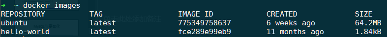

多了两个刚刚从 docker hub 上拉取下来的镜像。

### 查看容器

`docker ps` 加上 `-a` 参数查看所有的容器。

```bash
docker ps -a
```

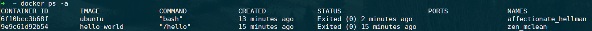

### 重启容器

```bash
docker ps -a
docker restart affectionate_hellman
docker ps
docker attach affectionate_hellman
```

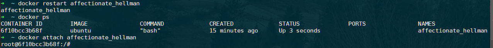

### 拉取镜像

```bash
docker pull mysql:5.7
```

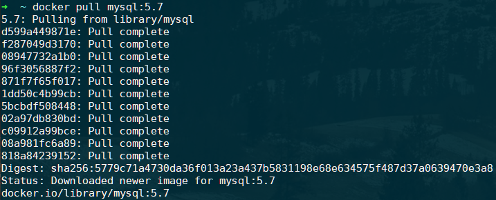

### 镜像构建

编写 dockerfile。

```dockerfile
FROM ubuntu
ENTRYPOINT ["top", "-b"]
CMD ["-c"]
```

构建镜像。

```bash
docker build . -t hello
```

运行容器。

```bash
docker run -it --rm hello -H
```

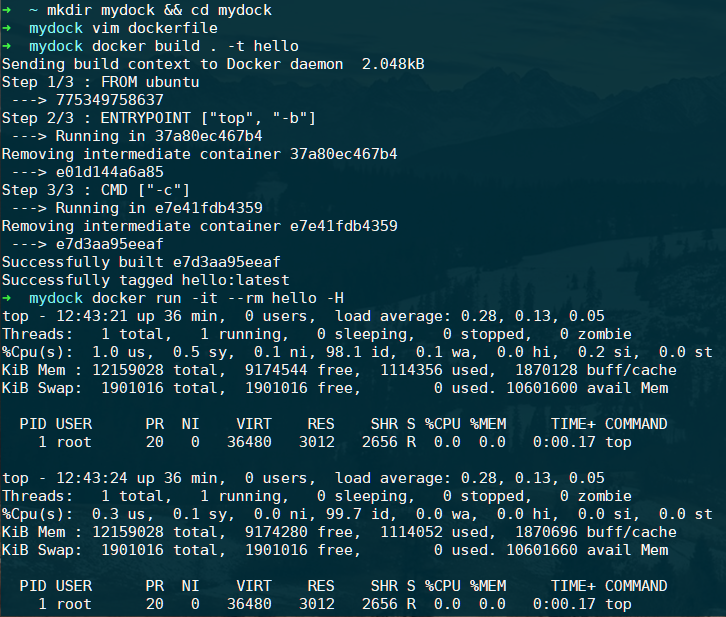

构建镜像的方式有两种，使用 dockerfile 构建是一种比较方便也比较常用的方法，而另一种是使用 `docker commit` 指令来将已有的容器保存为新的镜像，实际上 dockerfile 的底层就是一步一步使用 `docker commit` 指令帮我们实现镜像的构建的。

### 使用容器

```bash
# 运行一个 msyql 容器，命名为mysql2，并将容器的3306端口映射到宿主机的3316端口上
sudo docker run -p 3316:3306 --name mysql2 -e MYSQL_ROOT_PASSWORD=root -d mysql:5.7
docker ps
# 连接mysql容器
mysql -h127.0.0.1 -P3316 -uroot -p
```

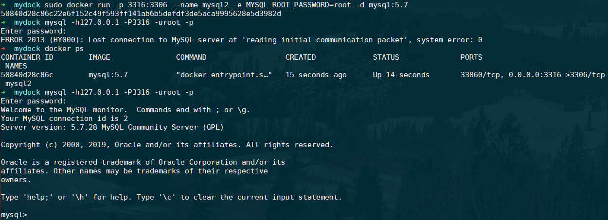

## docker-volume

创建卷并挂载。

```bash
# 删除容器
docker rm $(docker ps -a -q) -f -v
# 创建卷
docker volume create mydb
# 将卷挂载到/var/lib/mysql
docker run --name mysql2 -e MYSQL_ROOT_PASSWORD=root -v mydb:/var/lib/mysql -d mysql:5.7
```

启动客户端容器并连接服务器。

```bash
# 使用了--link连接两个容器，客户端容器内可以使用mysql这个别名访问服务器 
docker run --name myclient --link mysql2:mysql -it mysql:5.7 bash
```

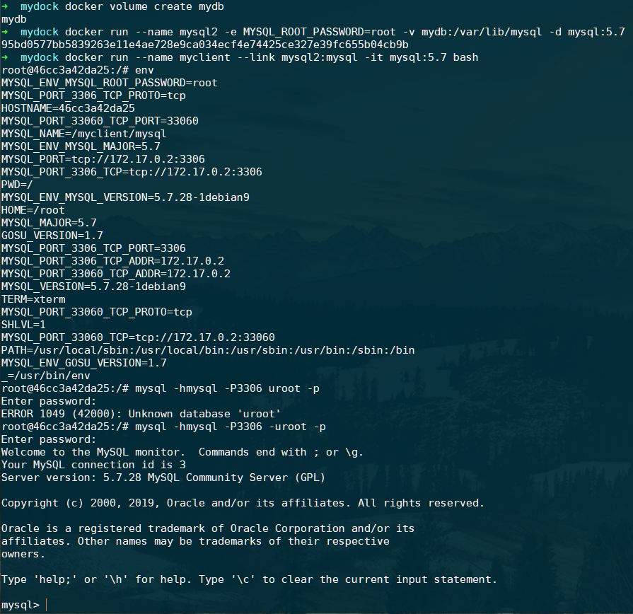

## docker-compose

编写 stack.yml。

```yaml
comptest]# vi stack.yml
version: '3.1'
services:
  db:
    image: mysql:5.7
    command: --default-authentication-plugin=mysql_native_password
    restart: always
    environment:
      MYSQL_ROOT_PASSWORD: example
  adminer:
    image: adminer
    restart: always
    ports:
      - 8080:8080
```

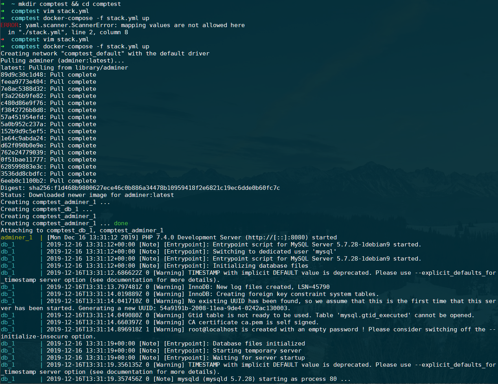

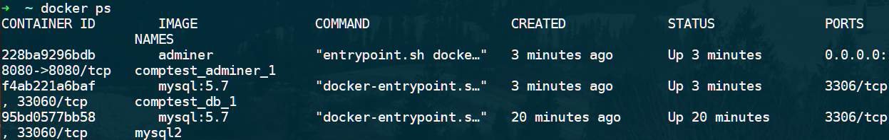

## docker-network

备制支持 ifconfig 和 ping 命令的 ubuntu 容器。

```bash
mkdir net && cd net
vim dockerfile
```

编写dockerfile。

```dockerfile
FROM ubuntu
ADD sources.list /etc/apt
RUN apt update && apt install -y net-tools iputils-ping
```

制作镜像。

```bash
docker build . -t net
```

创建自定义网络。

```bash
docker network create mynet
```

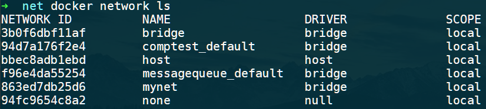

运行容器，并测试网络

```bash
docker run --name u1 -it -p 8080:80 --net mynet --rm net bash
docker run --name u2 --net mynet -it --rm net bash
```

结果是能够相互 ping 通的，并能够与宿主机进行通信。

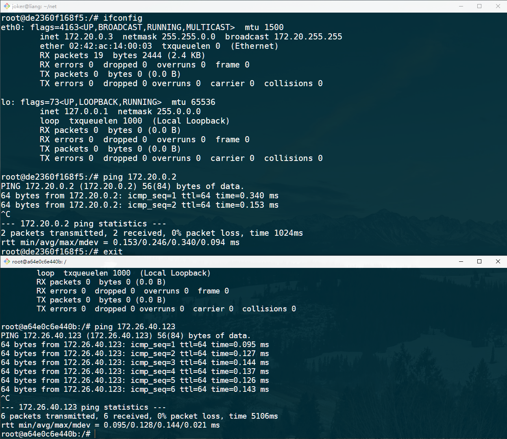

## docker-registry

常用仓库操作：

```
# 登陆
docker login --username=<your account> registry.cn-shenzhen.aliyuncs.com
# 标签
docker tag hello-world registry.cn-shenzhen.aliyuncs.com/pmlpml/repo:hello-world
# 上传
docker push registry.cn-shenzhen.aliyuncs.com/pmlpml/repo:hello-world
# 下载
docker push registry.cn-shenzhen.aliyuncs.com/pmlpml/repo:hello-world
# 标签
docker tag registry.cn-shenzhen.aliyuncs.com/pmlpml/repo:hello-world hello-world
# 删除
docker rmi registry.cn-shenzhen.aliyuncs.com/pmlpml/repo:hello-world
# 运行
docker run --rm hello-world
# 退出
docker logout registry.cn-shenzhen.aliyuncs.com
```