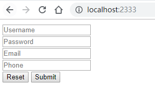
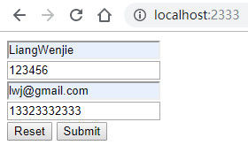
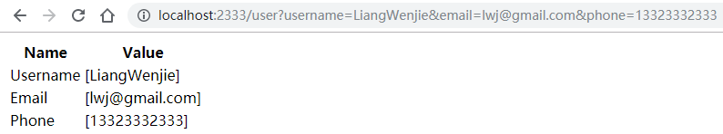
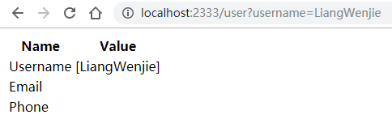
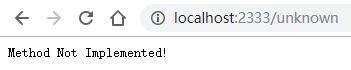

# 一个简单的 Golang Web 应用

一个极简版 Golang Web 应用 Demo。

## 路由规则

### route/route.go

使用 `http.HandleFunc` 方法注册路由规则。

```go
package route

import (
	"net/http"

	"github.com/liangwj45/Service-Computing/web/controller"
)

var handler = new(controller.Handler)

func init() {
	http.Handle("/", http.FileServer(http.Dir("public")))
	http.HandleFunc("/api/SignUp", handler.SignUp)
	http.HandleFunc("/user", handler.GetInfo)
	http.HandleFunc("/unknown", func(w http.ResponseWriter, req *http.Request) {
		w.WriteHeader(http.StatusNotImplemented)
		_, _ = w.Write([]byte("Method Not Implemented!"))
	})
}
```

## Model

### model/user.go

定义 `User` 结构体

```go
package model

type User struct {
	Username *string `json:"username"`
	Password *string `json:"password"`
	Email    *string `json:"email"`
	Phone    *string `json:"phone"`
}
```

## Controller

### controller/handler.go

请求处理逻辑。使用 `json.NewDecoder` 解析请求，并使用 `Template.Execute` 方法生成静态文件，将其返回客户端。

```go
package controller

import (
	"encoding/json"
	"html/template"
	"log"
	"net/http"

	"github.com/liangwj45/Service-Computing/web/model"
)

type Handler struct{}

var tpl *template.Template
var user = new(model.User)

func init() {
	tpl = template.Must(template.ParseFiles("templates/info.html"))
}

func (uc *Handler) SignUp(w http.ResponseWriter, req *http.Request) {
	if err := json.NewDecoder(req.Body).Decode(user); err != nil {
		req.Body.Close()
		log.Fatalln(err)
	}
	if err := tpl.Execute(w, user); err != nil {
		log.Fatalln(err)
	}
}

func (uc *Handler) GetInfo(w http.ResponseWriter, req *http.Request) {
	if err := tpl.Execute(w, req.URL.Query()); err != nil {
		log.Fatalln(err)
	}
}
```

## Main

### main.go

使用 `http.ListenAndServe` 方法监听端口。

```go
package main

import (
	"net/http"

	_ "github.com/liangwj45/Service-Computing/web/route"
)

func main() {
	_ = http.ListenAndServe(":2333", nil)
}
```

## 首页

### public/index.html

```html
<!DOCTYPE html>
<html lang="en">
<head>
  <title>Golang Web</title>
  <script src="https://cdn.bootcss.com/jquery/3.4.1/jquery.min.js"></script>
  <meta charset="utf-8" />
</head>

<body>
  <form class="form" id="register-form">
    <div class="input"><input type="text" id="username" placeholder="Username" /></div>
    <div class="input"><input type="text" id="password" placeholder="Password" /></div>
    <div class="input"><input type="email" id="email" placeholder="Email" /></div>
    <div class="input"><input type="tel" id="phone" placeholder="Phone" /></div>
    <button class="button" type="reset">Reset</button>
    <button class="button" type="submit" onclick="register()">Submit</button>
  </form>
</body>

<script>
$(document).ready(function () {
  document.getElementById("register-form").addEventListener("submit", function (e) {
    e.preventDefault();
    let username = $("#username")[0].value;
    let email = $("#email")[0].value;
    let phone = $("#phone")[0].value;
    window.location.href = `/user?username=${username}&email=${email}&phone=${phone}`;
  });
});
</script>
</html>
```

## 信息模板

### templates/info.html

```html
<!DOCTYPE html>
<html lang="en">
  <head>
    <title>User Info</title>
    <meta charset="utf-8" />
  </head>

  <body>
    <table class="table">
      <thead>
        <tr><th>Name</th><th>Value</th></tr>
      </thead>
      <tbody>
        <tr><td>Username</td><td>{{.username}}</td></tr>
        <tr><td>Email</td><td>{{.email}}</td></tr>
        <tr><td>Phone</td><td>{{.phone}}</td></tr>
      </tbody>
    </table>
  </body>
</html>
```

## 程序运行截图

### 首页

| 填写前                                        | 填写后                                        |
| :-------------------------------------------- | :-------------------------------------------- |
|  |  |

### 信息页面

| 点击Submit按钮                                |
| --------------------------------------------- |
|  |
| **手动填写URL**                               |
|  |

### Unknown

| unknow                                        |
| --------------------------------------------- |
|  |


